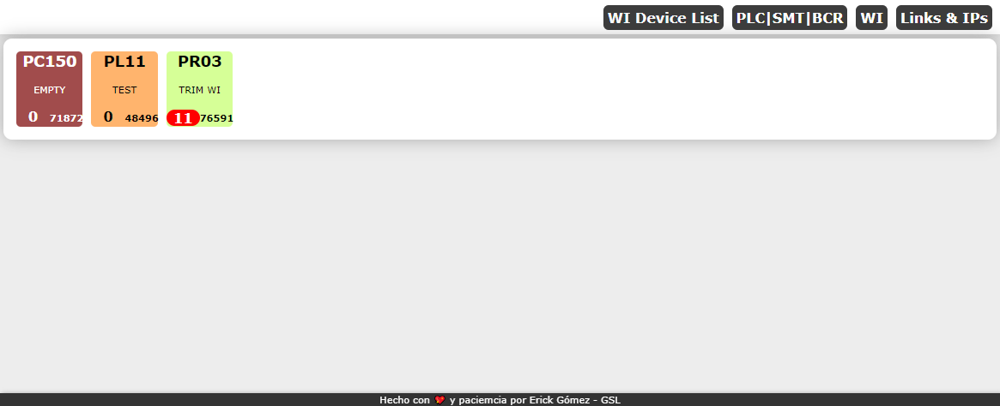
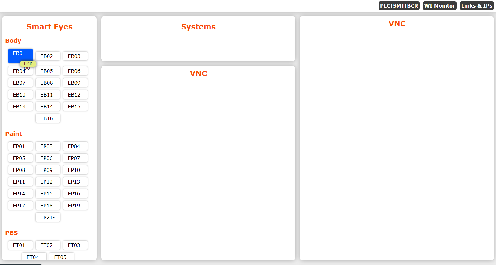

**SHOPFLOOR MONITORING SYSTEM**
=====================
This project is developed to works inside an automotive industry and focuses on monitoring the different shopfloor devices connected to a MES (Manufacturing Execute System).

Note: Some data is hidden due to privacy statements.

Languages, tools and frameworks used:
- Python
- SQL
- HTML
- JavaScript
- CSS
- Flask
- Postman
- Git
- IIS Windows Server 2016
- Zebra's IoTConnector

## **Main Dashboard**

The main dashboard is the monitoring of PLCs, Smart Eyes and BCR. The color changes dinamically depending of the status of the conection with MES (green for IDLE and red for DOWN). This status is over the system connections not directly over the network. In the BCR section is obtained data of Zebra DS3678 BCR, using IoTConnector by Zebra. This type of data is obtained for each BCR used to collect data to the MES.

## **WI Device Monitoring**

This dashboard displays the WI (Work Instruction) devices connected to MES, which receive the receipe or instruction of each unit, they could be a PC, PLC or printer. 
These devices are connected by TCP/IP; when they are idle will be green. When they lost network communication they will display a red color. And last if the system tries to recover the communication but the client does not respond, in the monitoring will displays an orange color. 

The bottom left data of each device is the last sequence sent and the right one is the spool/buffer, if it is greather than 5 it will displays a red color to alert that something is happening with the device.

In the WI monitor you can select which devices you want to watch.

## **Quick Links**

This page only contains quick and short information about Smart Eyes, systems and IPs.
The Smart Eyes are separated by plants. If you hover over the button it will diplays infomation about the location on the plant and if you click the button it will redirectionarates to the Smart Eye's web page monitor.

The rest of information is ommited due to privacy, since they are IPs

If you have any doubts or comments do not hesitate on write me.

:envelope: eerick.16@gmail.com